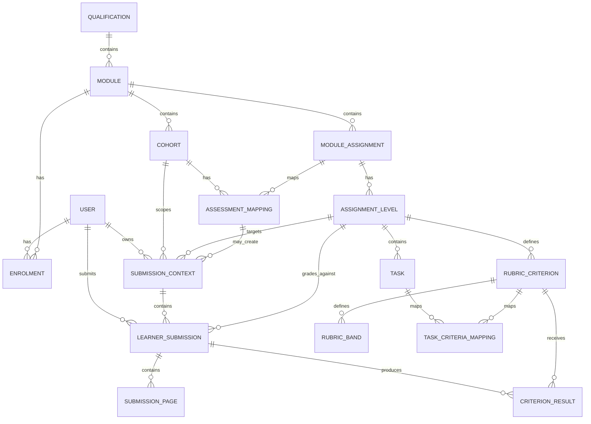

# AutoGrad3r Database

## Source of Truth

The authoritative database definition is the current Django models plus committed migrations.

This document is an architectural overview only. Do not use a static CSV database export as the migration source of truth.

When the schema changes:

1. update the Django model
2. create a migration
3. review the migration
4. apply it
5. update this document when the relationship diagram materially changes

## Core Domain Relationships

The current application is organized around these major domains:



The exact field names and nullability must be checked in the current models because the implementation may evolve.

## Main Model Groups

### Accounts

Typical account data includes:

- Django user
- profile/role information
- enrolment or membership relationships

Authentication is session-based in the application.

### Courses

The course hierarchy is:

```text
Qualification
  -> Module
      -> Cohort
      -> ModuleAssignment
          -> AssignmentLevel
```

An assignment can have multiple assignment levels/tracks. Assignment-level configuration owns the grading requirements that differ by level.

### Grading

The active grading configuration is centered on:

```text
AssignmentLevel
  -> Task
  -> RubricCriterion
      -> RubricBand
  -> TaskCriteriaMapping
```

`TaskCriteriaMapping` connects assignment tasks to rubric criteria.

Some internal grading/audit models may exist without having public generic CRUD APIs. Model existence does not imply that a corresponding frontend or REST endpoint should exist.

### Submissions

The submission structure is centered on:

```text
SubmissionContext
  -> LearnerSubmission
      -> SubmissionPage
      -> CriterionResult
      -> processing/audit records
```

A learner may have multiple attempts according to the configured attempt policy.

Submission status, final score, achieved band and feedback are persisted on the submission and/or related grading records as implemented by the current models.

### LMS

`AssessmentMapping` links the AutoGrad3r course/assignment context to an external LMS activity.

LTI-related identifiers may include values such as:

- platform issuer/client information
- deployment identifier
- resource/activity link identifier
- context/course identifier
- AGS-related line item or grade identifiers when applicable

Refer to `backend/lms/models.py` for the authoritative fields.

## Schema Inspection

Useful Django commands:

```bash
docker compose exec backend python manage.py showmigrations
```

```bash
docker compose exec backend python manage.py migrate --plan
```

```bash
docker compose exec backend python manage.py check
```

To inspect a model directly:

```bash
docker compose exec backend python manage.py shell
```

Then:

```python
from courses.models import AssignmentLevel
for field in AssignmentLevel._meta.get_fields():
    print(field.name, type(field).__name__)
```

## Static Schema Exports

Do not keep `database_schema.csv` as a permanent source-of-truth file unless there is a specific reporting requirement.

A static export becomes stale immediately after model or migration changes.

If a CSV schema is needed for audit or handover, regenerate it from the current database and date the exported file clearly.
