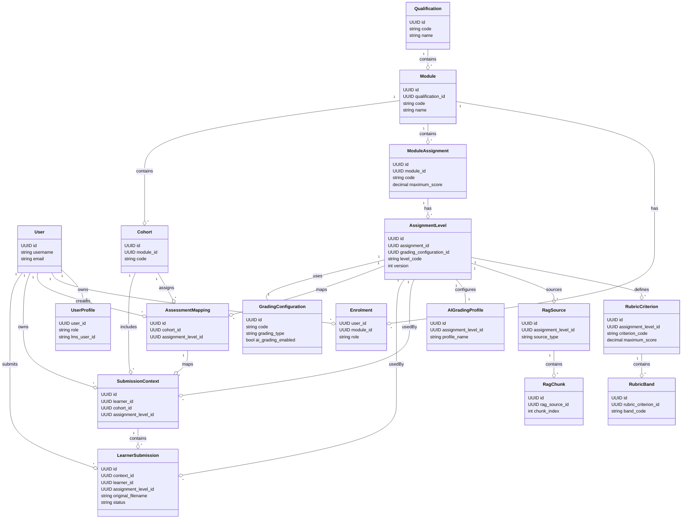
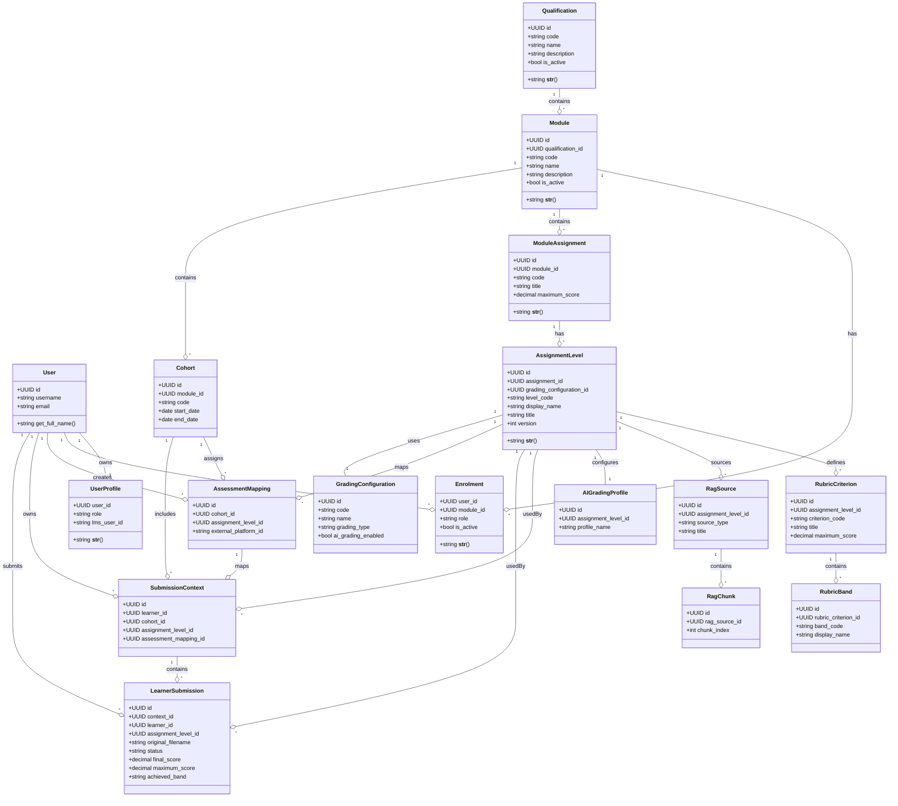

# Autograder Database Design Diagram

This diagram captures the core Django models and relationships used by the `autograder` backend.

```mermaid
erDiagram
    AUTH_USER ||--|| USER_PROFILE : has
    AUTH_USER ||--o{ ENROLMENT : participates
    AUTH_USER ||--o{ ASSESSMENT_MAPPING : creates
    AUTH_USER ||--o{ ASSESSMENT_MAPPING : updates
    AUTH_USER ||--o{ SUBMISSION_CONTEXT : owns
    AUTH_USER ||--o{ LEARNER_SUBMISSION : submits

    QUALIFICATION ||--o{ MODULE : contains
    MODULE ||--o{ ENROLMENT : has
    MODULE ||--o{ MODULE_ASSIGNMENT : contains
    MODULE ||--o{ COHORT : contains

    MODULE_ASSIGNMENT ||--o{ ASSIGNMENT_LEVEL : has
    ASSIGNMENT_LEVEL ||--o{ RUBRIC_CRITERION : has
    ASSIGNMENT_LEVEL ||--o{ RAG_SOURCE : has
    ASSIGNMENT_LEVEL ||--|| AI_GRADING_PROFILE : has
    ASSIGNMENT_LEVEL ||--o{ SUBMISSION_CONTEXT : targets
    ASSIGNMENT_LEVEL ||--o{ LEARNER_SUBMISSION : targets
    ASSIGNMENT_LEVEL ||--o{ ASSESSMENT_MAPPING : maps
    ASSIGNMENT_LEVEL ||--|| GRADING_CONFIGURATION : uses

    RUBRIC_CRITERION ||--o{ RUBRIC_BAND : defines
    RAG_SOURCE ||--o{ RAG_CHUNK : contains

    COHORT ||--o{ ASSESSMENT_MAPPING : assigns
    COHORT ||--o{ SUBMISSION_CONTEXT : includes

    SUBMISSION_CONTEXT ||--o{ LEARNER_SUBMISSION : contains
    ASSESSMENT_MAPPING ||--o{ SUBMISSION_CONTEXT : maps

    %% Entity definitions
    AUTH_USER {
        UUID id PK
        string username
        string email
        ...
    }

    USER_PROFILE {
        UUID id PK
        UUID user_id FK
        string role
        string lms_user_id
    }

    QUALIFICATION {
        UUID id PK
        string code
        string name
        text description
        bool is_active
    }

    MODULE {
        UUID id PK
        UUID qualification_id FK
        string code
        string name
        text description
        bool is_active
    }

    ENROLMENT {
        UUID id PK
        UUID user_id FK
        UUID module_id FK
        string role
        bool is_active
    }

    MODULE_ASSIGNMENT {
        UUID id PK
        UUID module_id FK
        int assignment_number
        string code
        string title
        decimal maximum_score
    }

    ASSIGNMENT_LEVEL {
        UUID id PK
        UUID assignment_id FK
        UUID grading_configuration_id FK
        string level_code
        string display_name
        string title
        json tasks
        json deliverables
        int version
    }

    GRADING_CONFIGURATION {
        UUID id PK
        string code
        string name
        string grading_type
        bool ai_grading_enabled
        decimal confidence_review_threshold
        json configuration
    }

    RUBRIC_CRITERION {
        UUID id PK
        UUID assignment_level_id FK
        string criterion_code
        string title
        decimal maximum_score
        bool ai_gradable
    }

    RUBRIC_BAND {
        UUID id PK
        UUID rubric_criterion_id FK
        string band_code
        string display_name
        decimal minimum_percentage
        decimal maximum_percentage
        text descriptor
    }

    RAG_SOURCE {
        UUID id PK
        UUID assignment_level_id FK
        string source_type
        string title
        text source_text
        json metadata
    }

    RAG_CHUNK {
        UUID id PK
        UUID rag_source_id FK
        int chunk_index
        text content
        json metadata
        vector embedding
    }

    AI_GRADING_PROFILE {
        UUID id PK
        UUID assignment_level_id FK
        string profile_name
        text system_prompt
        json output_schema
        decimal temperature
    }

    COHORT {
        UUID id PK
        string name
        string code
        UUID module_id FK
        date start_date
        date end_date
    }

    ASSESSMENT_MAPPING {
        UUID id PK
        string name
        UUID cohort_id FK
        UUID assignment_level_id FK
        string external_platform_id
    }

    SUBMISSION_CONTEXT {
        UUID id PK
        UUID learner_id FK
        UUID cohort_id FK
        UUID assignment_level_id FK
        UUID assessment_mapping_id FK
        bool is_active
    }

    LEARNER_SUBMISSION {
        UUID id PK
        UUID context_id FK
        UUID learner_id FK
        UUID assignment_level_id FK
        string original_filename
        int attempt_number
        string status
        decimal final_score
        decimal maximum_score
        string achieved_band
        text feedback
    }
```

## Compact UML-style Diagram



## Regenerated Workflow-focused ER Diagram

This section models the Assignment 1 workflow you described, including explicit mapping tables and evidence extraction.

```mermaid
erDiagram
    QUALIFICATION ||--o{ MODULE : contains
    MODULE ||--o{ COHORT : includes
    MODULE ||--o{ MODULE_ASSIGNMENT : contains

    MODULE_ASSIGNMENT ||--o{ ASSIGNMENT_LEVEL : has
    ASSIGNMENT_LEVEL ||--o{ TASK : includes
    ASSIGNMENT_LEVEL ||--o{ RUBRIC_CRITERION : defines
    ASSIGNMENT_LEVEL ||--|| GRADING_CONFIGURATION : uses

    TASK ||--o{ TASK_CRITERION_WEIGHT : weights
    RUBRIC_CRITERION ||--o{ TASK_CRITERION_WEIGHT : weighted_by
    TASK ||--o{ TASK_CRITERIA_MAPPING : maps_by_ai
    TASK_CRITERIA_MAPPING ||--|| TASK_CRITERION_WEIGHT : uses_weight

    LEARNER_SUBMISSION ||--o{ EXTRACTED_EVIDENCE : includes
    EXTRACTED_EVIDENCE ||--o{ TASK_EVIDENCE_MAP : supports
    TASK ||--o{ TASK_EVIDENCE_MAP : maps

    LEARNER_SUBMISSION ||--o{ PROMPT : generates
    PROMPT ||--o{ RESPONSE : produces
    RESPONSE ||--o{ CRITERION_RESULT : records

    QUALIFICATION {
        UUID id PK
        string code
        string name
    }
    MODULE {
        UUID id PK
        UUID qualification_id FK
        string code
        string name
    }
    COHORT {
        UUID id PK
        UUID module_id FK
        string code
        string name
    }
    MODULE_ASSIGNMENT {
        UUID id PK
        UUID module_id FK
        string assignment_code
        string title
    }
    ASSIGNMENT_LEVEL {
        UUID id PK
        UUID assignment_id FK
        string level_code
        string display_name
    }
    RUBRIC_CRITERION {
        UUID id PK
        UUID assignment_level_id FK
        string criterion_code
        string title
        decimal maximum_score
    }
    TASK {
        UUID id PK
        UUID assignment_level_id FK
        string task_code
        string title
        text instructions
    }
    TASK_CRITERION_WEIGHT {
        UUID id PK
        UUID task_id FK
        UUID rubric_criterion_id FK
        decimal weight_percentage
        enum band (FAILED, FOUNDATION, PROFICIENT, EXPERT)
    }
    TASK_CRITERIA_MAPPING {
        UUID id PK
        UUID assignment_id FK
        UUID task_id FK
        UUID rubric_criterion_id FK
        decimal inferred_weight
        text ai_explanation
        timestamp created_at
    }
    LEARNER_SUBMISSION {
        UUID id PK
        UUID context_id FK
        UUID assignment_level_id FK
        UUID learner_id FK
        string original_filename
        string status
    }
    EXTRACTED_EVIDENCE {
        UUID id PK
        UUID submission_id FK
        enum evidence_type (TEXT, IMAGE, TABLE, METADATA)
        text content_text
        string file_path
        decimal extraction_confidence
        timestamp created_at
    }
    TASK_EVIDENCE_MAP {
        UUID id PK
        UUID task_id FK
        UUID evidence_id FK
        string mapping_role (PRIMARY, SUPPORTING)
        decimal confidence_score
    }
    PROMPT {
        UUID id PK
        UUID submission_id FK
        enum stage (MAP_TASKS_CRITERIA, MAP_EVIDENCE_TASKS, FINAL_ASSESSMENT)
        text prompt_text
        json prompt_payload
        timestamp created_at
    }
    RESPONSE {
        UUID id PK
        UUID prompt_id FK
        string model_name
        json response_payload
        decimal confidence_score
        timestamp created_at
    }
    CRITERION_RESULT {
        UUID id PK
        UUID submission_id FK
        UUID rubric_criterion_id FK
        decimal awarded_marks
        string achievement_band
        text feedback
    }
    GRADING_CONFIGURATION {
        UUID id PK
        string code
        string grading_type
    }
    SUBMISSION_CONTEXT {
        UUID id PK
        UUID cohort_id FK
        UUID assignment_level_id FK
        UUID learner_id FK
    }

    %% legend: one-to-many and mapping relations are shown above
```

## Class Diagram


